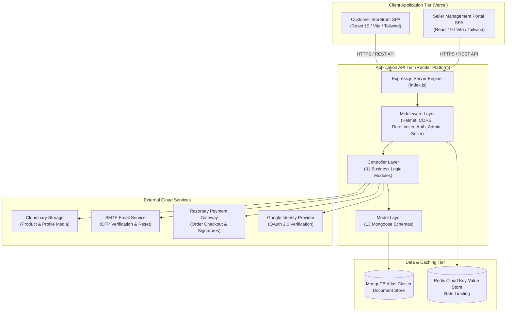
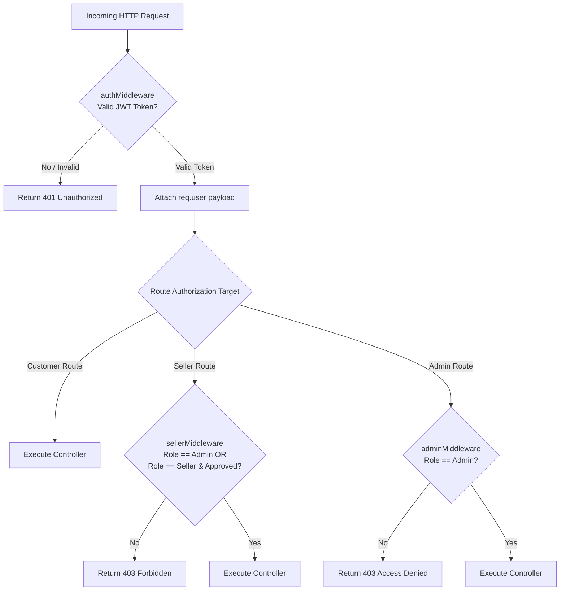
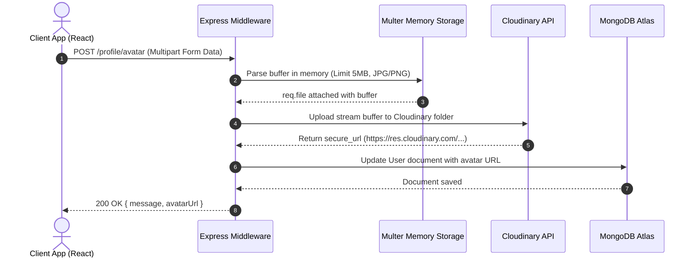
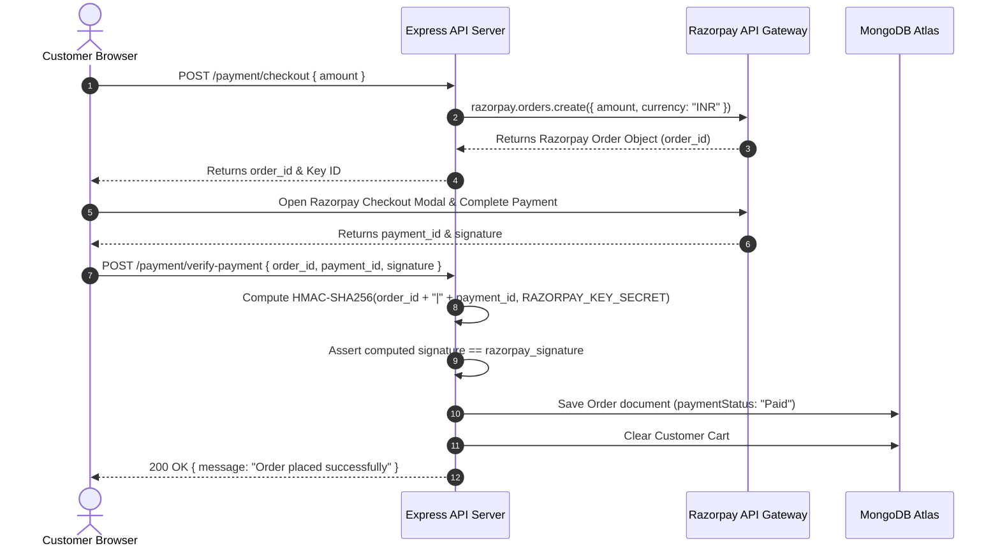
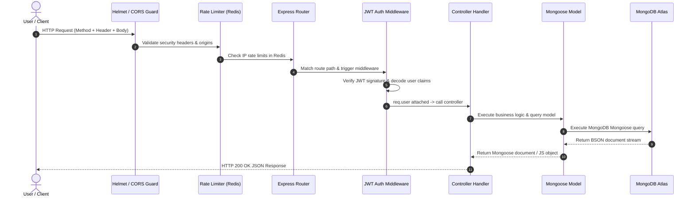

# HomeStore — Technical System Architecture

This document details the software architecture, design patterns, data flows, security mechanisms, and service integrations of **HomeStore — MERN Full-Stack Ecommerce Platform**.

---

## 🏛️ 1. High-Level System Architecture

HomeStore is designed around a multi-tier, decoupled architecture consisting of two specialized Single Page Applications (SPAs) deployed on Vercel and a single consolidated Express REST API server running on Render, connected to MongoDB Atlas, Redis Cloud, and external cloud services.



---

## 💻 2. Frontend Architecture

The frontend consists of two distinct React 19 web applications built using Vite:

### A. Customer Storefront (`Ecommerce-Frontend`)
- **Routing**: `react-router-dom` v7 with declarative route definitions for catalog, product details, user auth, cart, wishlist, orders, tracking, profile, and customer support.
- **State Management**: React Context API for global auth session management, cart state, wishlist persistence, and notification toasts.
- **HTTP Transport**: Axios instance configured with `baseURL = process.env.VITE_API_BASE_URL`, automatic JWT bearer token header injection, and response interceptors for handling 401 token refreshes.
- **UI & Analytics**: TailwindCSS v4 with custom responsive layouts, Lucide / React Icons, Recharts & Chart.js for data visualization, Swiper for media carousels, and Google OAuth 2.0 integration via `@react-oauth/google`.

### B. Seller Portal (`seller-frontend`)
- **Routing**: Independent SPA route structure tailored for seller administration (Dashboard, Product Management, Order Fulfillment, Analytics, Customer List, Store Profile).
- **Security Scoping**: Protected routes requiring authenticated users with `role === "seller"` and `sellerStatus === "approved"`.
- **Media Upload**: Built-in multipart form handling for product images, avatar customization, and store cover banners.

---

## ⚙️ 3. Backend Architecture

The backend (`Ecommerce-Backend`) is built on Express 5.2.1 running in CommonJS mode.

```
Ecommerce-Backend/
├── Index.js                # App initialization, CORS, Helmet, Rate Limiter, Route Mounting
├── config/                 # Service clients (Redis, Nodemailer, Cloudinary)
├── DataBase/               # MongoDB Mongoose connection handler (`db.js`)
├── Controller/             # 31 Express request handlers
├── MiddleWare/             # Security, Auth, RBAC, File Upload, and Joi Validation
├── Model/                  # 13 Mongoose Data Schemas
├── Routes/                 # 28 Express Router Modules
├── validation/             # Joi input validation schemas (`authValidation.js`)
├── helper/                 # JWT token generators (`token.js`)
└── templates/              # HTML email body templates
```

### Architectural Separation
- **Routes Layer**: Pure route declarations mapping HTTP methods and paths to middlewares and controllers.
- **Middleware Layer**: Enforces cross-cutting concerns (CORS, security headers, rate limiting, JWT verification, role check, payload validation, Multer file parsing).
- **Controller Layer**: Encapsulates business logic, database queries, third-party integrations, and standard response formatting.
- **Model Layer**: Defines Mongoose document schemas, default values, validations, indices, and virtual fields.

---

## 🔒 4. Authentication & RBAC Architecture

### Authentication Mechanism
1. **JWT Strategy**: Dual-token system featuring a short-lived Access Token (`JWT_TOKEN`) and a long-lived Refresh Token (`REFRESH_TOKEN_SECRET`).
2. **Access Token Delivery**: Sent via HTTP Authorization Header: `Authorization: Bearer <access_token>`.
3. **Password Security**: Passwords hashed using `bcrypt` with 10 salt rounds. Plaintext passwords are never stored or logged.
4. **Account Lockout**: 5 consecutive failed login attempts trigger a 15-minute account lock (`lockUntil`).
5. **Google OAuth 2.0**: Client-side ID token verification using Google's official `google-auth-library`.

### Role-Based Access Control (RBAC) Matrix

| Resource / Action | Public | Customer | Approved Seller | Admin |
| :--- | :---: | :---: | :---: | :---: |
| Browse Catalog / Search | ✅ | ✅ | ✅ | ✅ |
| Account Registration & Login | ✅ | ✅ | ✅ | ✅ |
| Manage Cart / Wishlist | ❌ | ✅ | ✅ | ✅ |
| Checkout & Place Orders | ❌ | ✅ | ✅ | ✅ |
| Submit Reviews & Questions | ❌ | ✅ | ✅ | ✅ |
| Apply for Seller Account | ❌ | ✅ | ❌ | ❌ |
| Manage Seller Products | ❌ | ❌ | ✅ | ✅ |
| Manage Seller Fulfillment | ❌ | ❌ | ✅ | ✅ |
| Access Seller Analytics | ❌ | ❌ | ✅ | ✅ |
| System Admin Dashboard | ❌ | ❌ | ❌ | ✅ |
| Approve / Reject Sellers | ❌ | ❌ | ❌ | ✅ |
| Global Order & User Admin | ❌ | ❌ | ❌ | ✅ |



---

## 🗄️ 5. Database Architecture

HomeStore uses MongoDB Atlas with 13 core Mongoose models:

1. **User (`UserModel.js`)**: Account details, hashed password, role (`user`, `seller`, `admin`), seller application status (`none`, `pending`, `approved`, `rejected`), OTP fields, lockout timestamps, and avatar/cover URLs.
2. **Product (`ProductModel.js`)**: Product title, price, description, category, brand, rating, review counts, stock quantity, seller reference (`sellerId`), and Cloudinary image URLs.
3. **Order (`orderModel.js`)**: Customer reference, items array (product, quantity, price, seller reference, item fulfillment status), shipping address, payment status, payment method (`Razorpay` or `COD`), Razorpay IDs, total amount, and delivery tracking information.
4. **Cart (`cartModel.js`)**: User ID reference and cart items list with quantity counters.
5. **Wishlist (`wishlistModel.js`)**: User ID reference and array of favorited product references.
6. **Address (`addressModel.js`)**: Customer saved delivery addresses (street address, city, state, postal code, country, phone, default flag).
7. **Review (`reviewModel.js`)**: Product ID, User ID, rating (1-5), comment string, and array of review image URLs.
8. **Question (`questionModel.js`)**: Product ID, customer user ID, question text, answer text, and answered timestamp.
9. **Coupon (`couponModel.js`)**: Coupon code string, percentage/fixed discount value, minimum purchase requirement, expiration date, active status.
10. **Return (`returnModel.js`)**: Order ID, user ID, reason, return status (`Pending`, `Approved`, `Rejected`), and admin comments.
11. **Notification (`notificationModel.js`)**: User ID, message, read flag, type, and timestamp.
12. **Category (`categoryModel.js`)**: Unique category names.
13. **Brand (`brandModel.js`)**: Unique brand names.

---

## 🖼️ 6. Image Upload & Cloudinary Pipeline

HomeStore integrates Cloudinary for cloud media storage:



---

## 💳 7. Payment Verification Architecture



---

## 📧 8. Email Notification Architecture

Nodemailer handles transactional email operations using SMTP:
- **Email Verification OTP**: 6-digit cryptographic code sent during user registration.
- **Password Reset OTP**: 6-digit code for account password recovery.
- **Email Templates**: HTML formatted email templates (`templates/`) with HomeStore branding.

---

## ⚡ 9. Redis Caching & Rate Limiting

Redis Cloud serves as the backing store for rate limiting:
- **Rate Limiters**:
  - `authLimiter`: 5000 requests / minute on authentication routes (`/login`, `/register`, `/verify-otp`).
  - `productLimiter`: 1000 requests / minute on `/products` routes.
  - `adminLimiter`: 1000 requests / minute on `/admin` routes.
- **Fail-Open Strategy**: If Redis experiences network disruption, `sendRedisCommand` logs a warning and fails open to ensure non-blocking user API execution.

---

## 🔄 10. End-to-End Request Lifecycle


